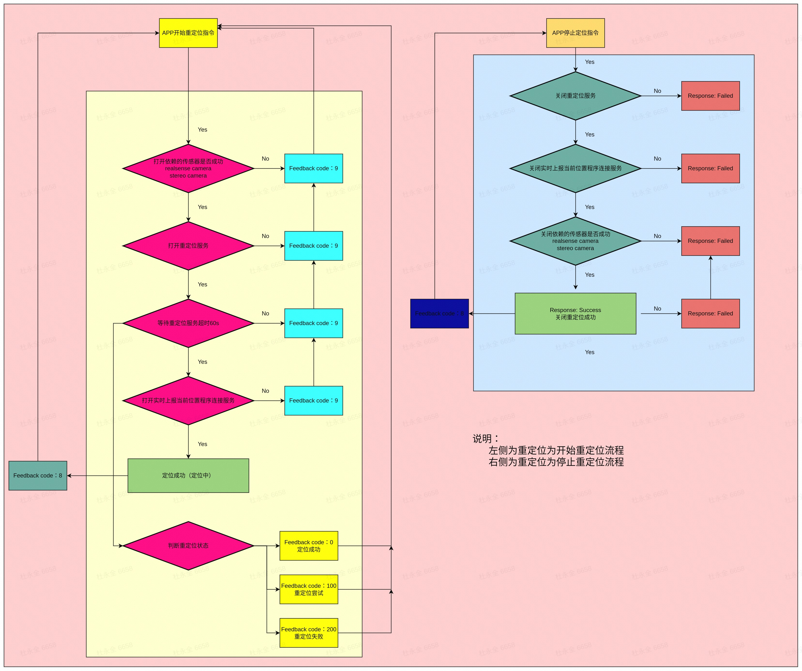

<center> <font color='green' size=10>Robot Naviation </font></center>


## 1 架构说明

* 节点node的管理以ROS lifecycle
* 开始任务的接口是ros action server
* 停止任务的接口是ros client & server

### 1.1 激光建图


步骤：

- step 1： 判断建图模式
- step 2： 打开realsense传感器
- step 3： 通知建图服务程开始建图
- step 4： 判断是否实时上报机器人当前位置
- step 5： 开始建图

### 1.2 激光定位


步骤：

- step 1： 判断打开realsense传感器
- step 2： 通知重定位服务程开始重定位功能
- step 3： 等待结果是否超时，超时直接退出定位，否者等待定位结果
- step 4： 判断重定位状态， 0成功， 100重试和200失败
- step 5： 定位成功

### 1.3 视觉建图


步骤：

- step 1： 判断建图模式
- step 2： 打开realsense传感器、双目传感器
- step 3： 通知建图服务程开始建图
- step 4： 判断是否实时上报机器人当前位置
- step 5： 开始建图

### 1.4 视觉定位



步骤：

- step 1： 判断打开realsense传感器、双目传感器
- step 2： 通知重定位服务程开始重定位功能
- step 3： 等待结果是否超时，超时直接退出定位，否者等待定位结果
- step 4： 判断重定位状态， 0成功， 100重试和200失败
- step 5： 定位成功

### 1.5 AB点导航


步骤：

- step 1： 判断打开bt_navigator
- step 2： 接受导航点B点位置，判断导航点有效性
- step 3： 发送开始AB导航
- step 4： 实时上报导航状态
- step 5： 导航成功

## 2 相关接口

## 2.1 激光建图

（visualization::srv::Stop::Request)visualization/Stop.srv消息格式

```
bool finish
string map_name
---
bool success
string message 
```

* 依赖的lifecycle： ["map_builder", "camera/camera"]*
* 依赖的服务："start_mapping", "stop_mapping"

step1： 激活依赖的lifecycle

```bash
ros2 lifecycle set /map_builder 1
ros2 lifecycle set /map_builder 3
```

step2：启动建图服务

```bash
ros2 service call /start_mapping std_srvs/srv/SetBool "data: true"
```

step3: 关闭建图服务

```
ros2 service call /stop_mapping visualization/srv/stop "finish: true map_name: map"
```

### 2.2 激光定位

* 依赖的lifecycle： ["start_location", "camera/camera"

* 依赖的服务："start_location", "stop_location"

step1：激活依赖的lifecycle

```bash
ros2 lifecycle set /localization_node 1
ros2 lifecycle set /localization_node 3
```

step2：启动定位服务

```bash
ros2 service call /start_location std_srvs/srv/SetBool "data: true"
```

step3: 关闭定位服务

```bash
ros2 service call /stop_location std_srvs/srv/SetBool "data: true"
```

### 2.3 视觉建图

(cyberdog_visions_interfaces::srv::FinishMap)cyberdog_visions_interfaces/FinishMap.srv消息格式

```bash
bool finish
string map_name
---
bool success
string message 
```

* 依赖的lifecycle： ["mivinsmapping", "camera/camera"]
* 依赖的服务："start_vins_mapping", "stop_vins_mapping"

step1：激活依赖的lifecycle

```bash
ros2 lifecycle set /mivinsmapping 1
ros2 lifecycle set /mivinsmapping 3
```

step2：启动建图服务

```bash
ros2 service call /start_vins_mapping std_srvs/srv/SetBool "data: true"
```

step3: 关闭建图服务

```bash
ros2 service call /stop_vins_mapping cyberdog_visions_interfaces/srv/FinishMap "finish: true map_name: map"
```

### 2.4 视觉定位

* 依赖的lifecycle： ["mivinslocalization", "camera/camera_align"]
* 依赖的服务："start_vins_location", "stop_vins_location"

step1：激活依赖的lifecycle

```bash
ros2 lifecycle set /mivinslocalization 1
ros2 lifecycle set /mivinslocalization 3
```

step2：启动定位服务

```bash
ros2 service call /start_vins_location std_srvs/srv/SetBool "data: true"
```

step3: 关闭定位服务

```bash
ros2 service call /stop_vins_location std_srvs/srv/SetBool "data: true"
```

### 2.5 AB点导航

* 依赖的lifecycle： ["controller_server_ab", "planner_server_ab", "recoveries_server" , "bt_navigator_ab"]

* ros接口：action，类型：protocol/action/Navigation，名称："start_algo_task"

  ROS action： “start_algo_task”

  类型： protocol::action::Navigation

  文件所在位置： protocol/action/Navigation.action

```c++
#goal definition
uint8 NAVIGATION_TYPE_START_AB = 1
uint8 NAVIGATION_TYPE_START_LOCALIZATION = 7
uint8 NAVIGATION_TYPE_STOP_LOCALIZATION = 8

uint8 nav_type

geometry_msgs/PoseStamped[] poses # 导航的目标点设置

string label_id
string map_name
bool outdoor
---
#result definition
uint8 result
uint8 NAVIGATION_RESULT_TYPE_SUCCESS = 0 
uint8 NAVIGATION_RESULT_TYPE_ACCEPT = 1
uint8 NAVIGATION_RESULT_TYPE_UNAVALIBLE =2
uint8 NAVIGATION_RESULT_TYPE_FAILED = 3
uint8 NAVIGATION_RESULT_TYPE_REJECT = 4
uint8 NAVIGATION_RESULT_TYPE_CANCEL = 5
---
#feedback definition
int32 feedback_code
string feedback_msg
```

#### 2.5.1 发送导航点

Action Request

```Plain
nav_type = 1
outdoor = false # 室内true or 室外false
geometry_msgs/PoseStamped[] poses # 导航的目标点设置
```

根据标签查询中的outdoor字段，这里应该填相应的outdoor的值

Action Feedback

```Markdown
feedback_code :

成功
- 导航启动成功，设置目标点成功，正在规划路径： 300
- 正在导航中： 307
- 到达目标点：308

- 失败
- 地图不存在：301
- 底层导航失败：
- 底层导航功能服务连接失败，请重新发送目标：302
- 发送目标点失败，请重新发送目标：303
- 底层导航功能失败，请重新发送目标：304
- 目标点为空，请重新选择目标：305
- 规划路径失败，请重新选择目标： 306

- 地图检查服务feedback_code ：
  - 正在检查地图：309
  - 地图检查成功： 310
  - 地图不存在，请重新建图： 311
```

Action Result 

```YAML
result
# NAVIGATION_RESULT_TYPE_SUCCESS = 0 : 成功
# NAVIGATION_RESULT_TYPE_ACCEPT = 1  : 接受
# NAVIGATION_RESULT_TYPE_UNAVALIBLE =2 ： 不可用
# NAVIGATION_RESULT_TYPE_FAILED = 3    ： 失败
# NAVIGATION_RESULT_TYPE_REJECT = 4    ： 拒绝
# NAVIGATION_RESULT_TYPE_CANCEL = 5    ： 取消
```

#### 2.5.2 取消AB点导航

ROS service： “stop_algo_task”

类型：protocol::srv::StopAlgoTask

文件所在位置： protocol/srv/StopAlgoTask.srv

```YAML
uint8 ALGO_TASK_ALL= 0
uint8 ALGO_TASK_AB = 1
uint8 ALGO_TASK_LOCALIZATION = 7

uint8 task_id
string map_name
---
int8 SUCCESS  = 0
int8 FAILED  = 1
int8 result 
```

Request

```Plain
task_id = 1
```

Response

```Plain
int8 SUCCESS  = 0
int8 FAILED  = 1
int8 result 
```

- **说明：**

- -  取消导航只会停止当前的机器人运动，不会释放导航相关的资源和定位。
